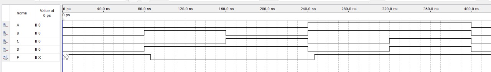

# EXPERIMENT 04: IMPLEMENTATION OF COMBINATIONAL LOGIC USING UNIVERSAL GATES
## AIM:
To implement the given logic function using NAND and NOR gates and to verify its operation in Quartus using Verilog programming.  
F=((C'.B.A)'(D'.C.A)'(C.B'.A)')' using NAND gate  
F=(((C.B'.A)+(D.C'.A)+(C.B'.A))')' using NOR gate  

## EQUIPMENT'S REQUIRED:
1. Hardware – PCs, Cyclone II , USB flasher
2. Software – Quartus prime
3. Theory
 
## PROCEDURE:
1. Use module projname(input,output) to start the Verilog programmming.  
2. Assign inputs and outputs using the word input and output respectively.  
3. Use defined keywords like wire,assign and required logic gates to represent the boolean expression.  
4. Represent the output according to the given boolean expression(Using either NAND or NOR gate) 
5. End the verilog program using keyword endmodule.  

## PROGRAM:
/*
Program to design a Implementation of combinational logic using universal gates-  and verify its truth table in quartus using Verilog programming.
Developed by: Rithiga Sri.B
RegisterNumber:  212221230083

VERILOG PROGRAMMING TO IMPLEMENT GIVEN LOGIC FUNCTION USING NAND GATE:  
module universalgates(A,B,C,D,F);  
input A,B,C,D;  
output F;  
wire P,Q,R;  
assign P=C&~B&~A;  
assign Q=D&~C&~A;  
assign R=~C&B&~A;  
assign F=(~P&~Q&~R);  
endmodule  

VERILOG PROGRAMMING TO IMPLEMENT GIVEN LOGIC FUNCTION USING NOR GATE:  
module ex4(A,B,C,D,F);  
input A,B,C,D;  
output F;  
wire P,Q,R,S;  
assign P=(C&~B&A);  
assign Q=(D&~C&A);  
assign R=(C& ~B&A);  
assign S=~(P|Q|R);  
not(F,S);  
endmodule  
*/

## OUTPUT:
## IMPLEMENTATION OF GIVEN LOGIC FUNCTION USING NAND GATE:
### TRUTH TABLE:

###  RTL REALIZATION:

### TIMING DIAGRAM:

## IMPLEMENTATION OF GIVEN LOGIC FUNCTION USING NOR GATE:
### TRUTH TABLE:

###  RTL REALIZATION:

### TIMING DIAGRAM:

## RESULT:
The given logic function is implemented using NAND and NOR gates and it is verified successfully in Quartus using Verilog programming.

 
